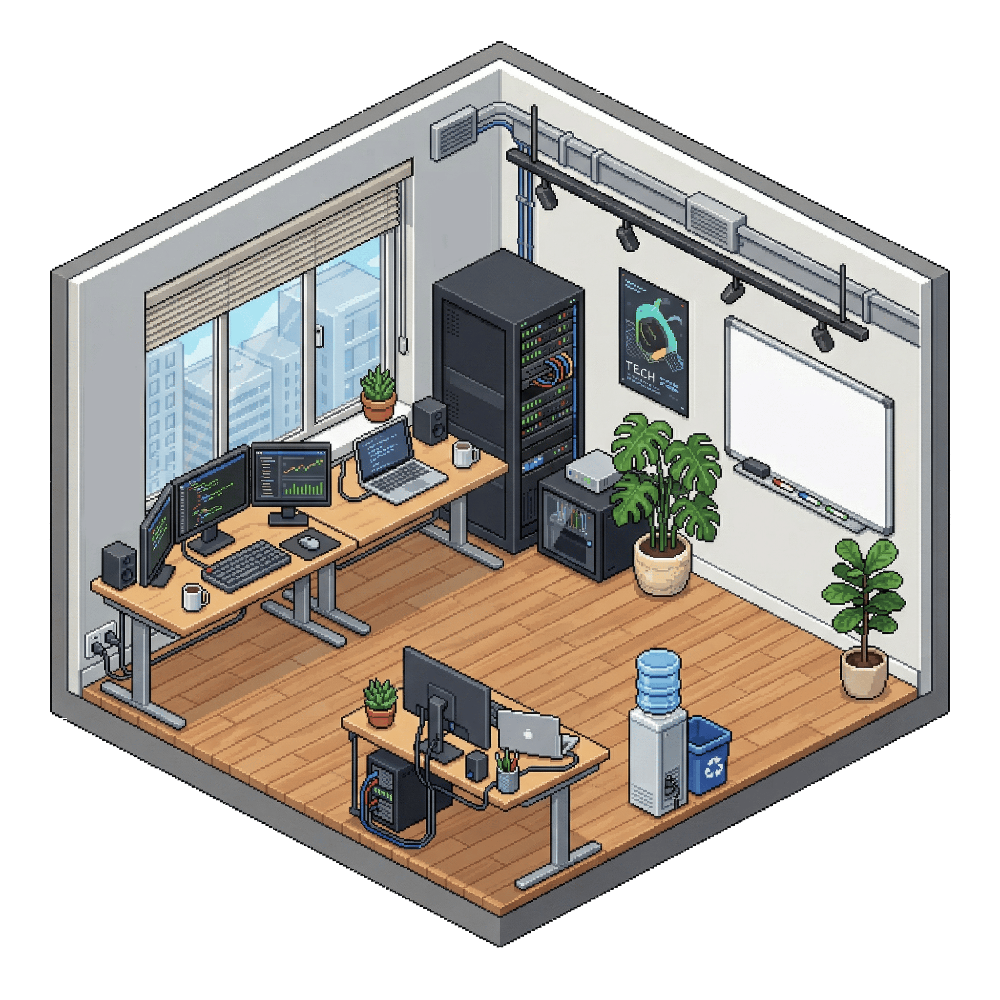

# NOVA — Agent Workspace 🤖

**Nucleus Orchestrator for Virtual Agents**  
A high-fidelity, interactive office environment for autonomous coding agents. NOVA provides a physical workspace for your AI agents, where they can roam, think, and execute tasks in dedicated persistent terminals.



## ✨ Features

- **Autonomous Agent Visuals**: Beautiful sprite-based character animations with support for walking, idling, and "thinking" states.
- **Persistent Terminals**: Every agent manages its own project folder with a real, integrated terminal (powered by `xterm.js` and `node-pty`).
- **Dynamic Office Environment**:
    - **Depth Sorting**: Agents naturally overlap based on their vertical position, creating a 3D depth illusion.
    - **Walkable Zones**: Precise pathing logic to keep agents within the office floor boundaries.
    - **Ambient Particles**: Subtle visual effects for a premium "living" workspace feel.
- **Developer Suite (Ctrl+D)**:
    - **Floor Drawing**: Draw custom walkable paths directly on the floor.
    - **Point Tweaking**: Interactive drag-and-drop system to refine paths.
    - **Anchor Adjustment**: Visually align character pivot points for perfect floor placement.
- **Smart Persistence**: All floor paths, anchor settings, and project metadata are automatically synced to the server.

## 🚀 Tech Stack

- **Frontend**: Vanilla JavaScript, CSS3 (Glassmorphism, CSS Variables, Modern Gradients), HTML5 (Semantic).
- **Backend**: Node.js, Express.
- **Communication**: WebSockets for real-time terminal streaming.
- **Process Management**: `node-pty` for pseudo-terminal execution on the host machine.
- **Integration**: Designed to work seamlessly with local LLMs like Ollama.

## 🛠️ Installation

1. **Prerequisites**:
    - Node.js (v18 or higher)
    - Ollama (Optional, for agent intelligence)

2. **Clone & Install**:
    ```bash
    git clone https://github.com/yourusername/nova.git
    cd nova
    npm install
    ```

3. **Run the Workspace**:
    ```bash
    npm start
    ```
    Access the UI at `http://localhost:3000`.

## 🎮 How to Use

- **Spawn Agent**: Click the "Spawn Agent" button, name your project, and choose an appearance (Emoji or Spirit).
- **Interact**: Click an agent to open its terminal.
- **Dev Mode (`Ctrl + D`)**: 
    - Use the floating toolbar to **Draw** new paths or **Tweak** existing ones.
    - Click **Save & Apply** to persist changes to `walkable_path.json`.
- **Visualize Mode**: Toggle via the settings gear (top right) to see/adjust agent foot anchors.

## 📂 Project Structure

- `/public`: Frontend assets, styles, and logic.
- `/projects`: The actual workspace folders for your agents.
- `server.js`: Express server and terminal orchestrator.
- `walkable_path.json`: Persistent floor configuration.
- `anchor_config.json`: Persistent sprite alignment data.

## 📜 License
MIT
