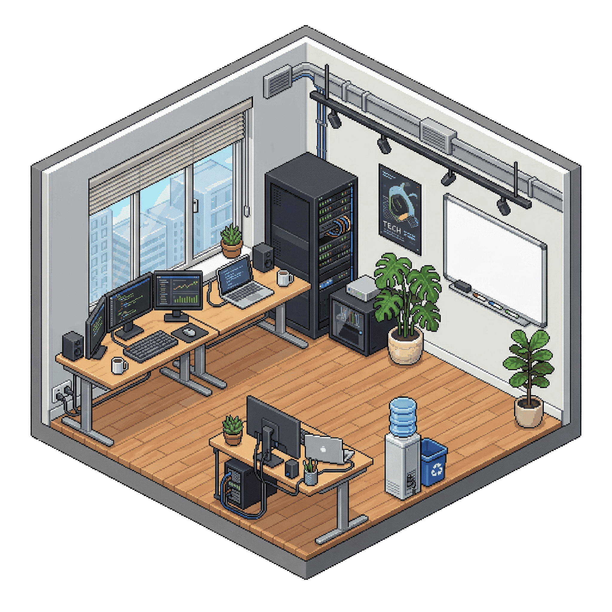

# NOVA — Agent Workspace 🪐

**Nucleus Orchestrator for Virtual Agents**  
A high-fidelity, interactive office environment for autonomous coding agents. NOVA gives your AI agents a spatial workspace: they can roam the office, run shells, and hold **chat** or **terminal** sessions backed by real processes and WebSockets.



## Features

### Core Experience
- **Multi-workspace environments**: Switch between **NOVA HQ Office** and **Space Station** with chevron navigation (‹ ›). Each workspace has independent agents, configurations, and layouts.
- **Autonomous agent visuals**: Sprite-based walking and idle animations, with status cues (thinking, done, error) tied to agent state.
- **Chat + terminal per agent**: Each agent has **chat mode** (streamed Claude-style CLI output over WebSockets) and classic **terminal mode** (`xterm.js` + `node-pty`). Tool use and partial streams can surface in the UI while the model works.
- **Deploy existing agents**: Use the **"📦 Deploy Existing Agent"** option in the spawn menu to add agents from other workspaces to your current workspace.

### Chat & Terminal UX
- **Chat UX**: WhatsApp-style typing indicator, optional processing-gap hints so quiet periods do not look like a freeze, and an **activity stream** for tool calls (e.g. web search) before the final answer. **Copy** on assistant bubbles includes a clear success state.
- **Cancel while busy**: When an agent is thinking or streaming, the send button becomes **stop**; **Escape** cancels the in-flight chat operation (similar spirit to terminal interrupt).
- **Comfortable input**: Chat input **grows with content** up to a sensible limit, supports **vertical resize** via **top-right handle** (drag up to expand), then **scrolls** for very long messages.
- **Advanced window controls**: **Double-click header** to maximize/restore; drag header to move; resize from **all four corners** plus **any edge** when floating. Up to **three** panels can **dock** to the right; docked width is adjustable from the left edge of the dock.

### Workspace Management
- **User-driven scheduling**: Create custom schedules for agents with **precise timing** (specific times or intervals), **broadcast** or **per-agent** targeting, and **visual action** selection with avatar previews — **per workspace**.
- **Smart folder navigation**: Click folder path in terminal headers to **open in Finder** (or system file manager) with convenient copy-path option.
- **Workspace isolation**: Each workspace maintains separate walkable paths, objects, actions, schedules, and agent configurations while sharing the global agent pool.

### Technical Features  
- **Multi-service LLM support**: Switch between **Ollama (local)**, **Claude**, **Sumo**, and **custom** endpoints from the UI (model badge / settings flows).
- **Integrated `CLAUDE.md` editor**: Open from the terminal header menu to edit agent instructions in place.
- **Day / night & weather**: Workspace themes follow time of day; weather-style ambience can follow real location (Open-Meteo) when enabled.
- **Multiple environments**: NOVA HQ office with depth sorting, walkable zones, dev-mode layout tools, plus Space Station environment with distinct visuals and configurations.
- **Roles & visibility**: Agents, captains, and pets; per-entity visibility toggles in the sidebar without necessarily killing processes.
- **Safe removals**: Confirmations for destructive actions (e.g. delete agent, dismiss pet).
- **Ambient media**: Lightweight music / video controls that stay unobtrusive until needed.

## Tech stack

- **Frontend**: Vanilla JavaScript (ES modules), CSS (variables, glass-style UI), HTML5.
- **Backend**: Node.js, Express.
- **Real-time**: WebSockets for chat streams, terminal I/O, and related sync.
- **Terminal**: `node-pty` + `xterm.js` (with fit addon).
- **Models**: Ollama and Anthropic Claude (via server-spawned CLI / configured paths — see `server.js` and project settings).

## Installation

1. **Prerequisites**
   - Node.js v18+ recommended  
   - Ollama and/or Claude CLI setup as needed for your chosen backend  

2. **Clone and install**

   ```bash
   git clone https://github.com/ryansetia1/nova.git
   cd nova
   npm install
   ```

3. **Run**

   ```bash
   npm start
   ```

   Open `http://localhost:3000`.

4. **Electron (optional)**

   ```bash
   npm run electron:dev    # dev
   npm run build && npm run dist   # macOS build
   ```

## How to use

### Workspace Management
- **Switch workspaces**: Use the chevron buttons **‹ ›** around the workspace title to switch between NOVA HQ and Space Station.
- **Deploy existing agents**: Click the spawn dropdown arrow (▾) → **"📦 Deploy Existing Agent"** → select agents from other workspaces to add to current workspace.

### Agent Operations  
- **Spawn new agent**: Use the spawn flow; pick name, appearance (emoji or character), and project path as prompted.
- **Chat vs terminal**: Use the 💬 / 💻 toggle on the panel header.
- **Switch model / service**: Click the model badge in the header.
- **Edit rules**: Header menu → **Edit CLAUDE.md**.
- **Cancel reply**: While the agent is busy, click **stop** or press **Escape**.

### Window Controls
- **Maximize/restore**: **Double-click** anywhere on the header to maximize or restore window.
- **Dock**: Yellow header dot pins the panel to the right stack (max three).
- **Resize**: All **four corner** handles plus **edge handles** when floating; docked panels — drag the **left** strip to change shared dock width.
- **Chat input resize**: Drag the **top-right handle** upward to expand input area.
- **Folder navigation**: Click folder path in header for "Open in Finder" options.

### Workspace Configuration
- **Scheduling**: Right-click → **Manage Schedules** to create agent schedules with precise timing and actions (per workspace).
- **Sidebar eye icon**: Hide or show an entity on the floor.
- **Dev mode (`Ctrl+D`)**: Layout and position tools for the workspace — create **actions** for scheduling.
- **Visualize mode** (settings gear): Adjust per-character foot anchors.

## Troubleshooting

- **[Troubleshooting guide](troubleshooting/GUIDE.md)** — hangs, sprites, crashes, PTY issues.  
- **Quick repair**: `./troubleshooting/repair.sh` — clears common lock / zombie issues.

## Project structure

| Path | Role |
|------|------|
| `public/` | Frontend: `main.js`, `terminal.js`, `walking.js`, `style.css`, assets |
| `server.js` | HTTP + WebSockets, process spawn for chat/terminal |
| `electron.js` | Desktop shell (optional) |
| `projects/` | **Global** agent project directories (shared across workspaces) |
| `workspaces/` | **Per-workspace** configurations and data |
| `workspaces/office/` | NOVA HQ workspace: `workspace.json`, `walkable_path.json`, `foreground_objects.json`, `actions.json`, `schedules.json`, `anchor_config.json`, `agents.json` |
| `workspaces/spacestation/` | Space Station workspace: same structure as office, independent configs |

### Workspace Structure

Each workspace folder contains:
- `workspace.json` — Metadata (name, icon, background images)
- `walkable_path.json` — Floor navigation polygons  
- `foreground_objects.json`, `ambient_objects.json` — Placed objects and media
- `actions.json` — Action points for agent scheduling
- `schedules.json` — User-created agent schedules
- `anchor_config.json`, `character_config.json` — Character positioning and behavior
- `agents.json` — List of agents deployed to this workspace

Agent-oriented implementation details for contributors and coding agents are summarized in **[CLAUDE.md](CLAUDE.md)**.

## License

MIT
